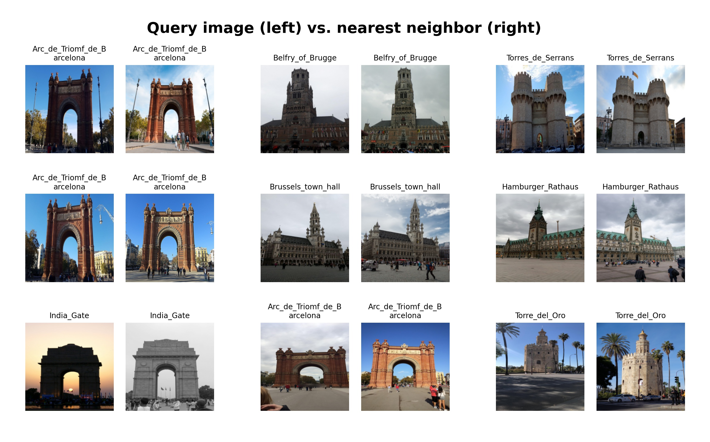
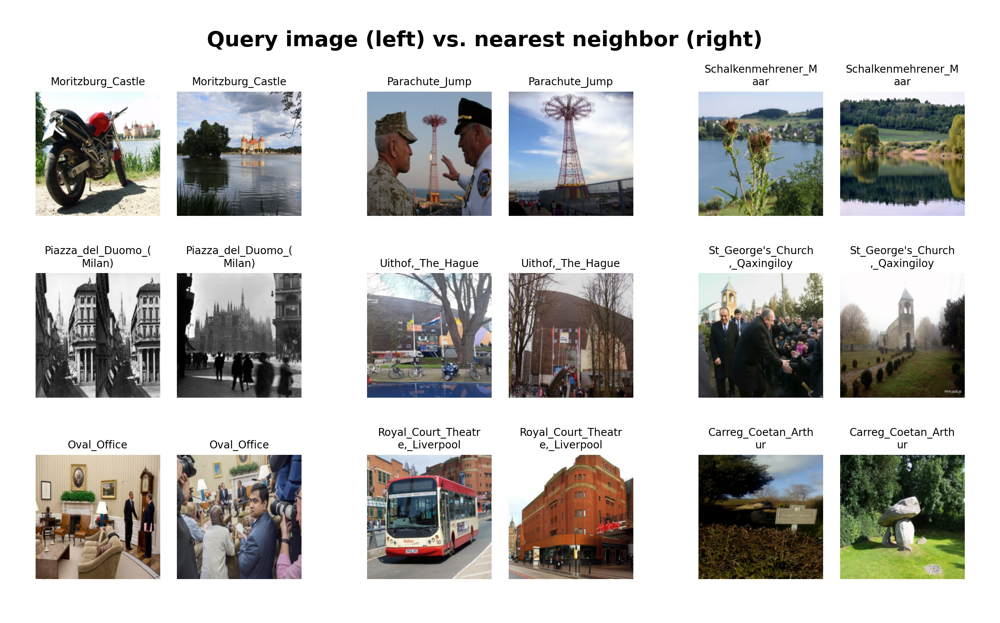
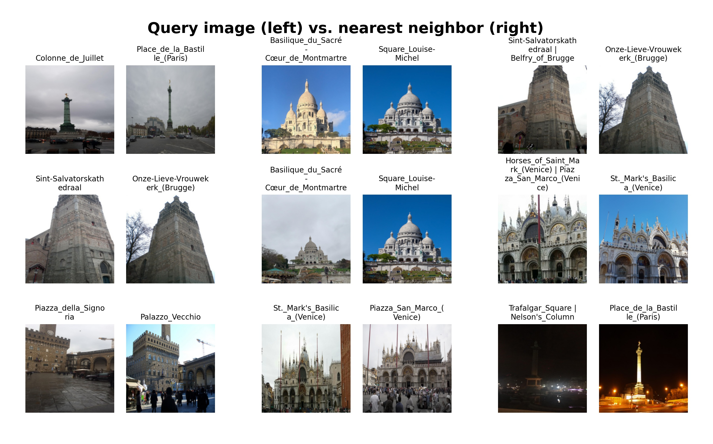
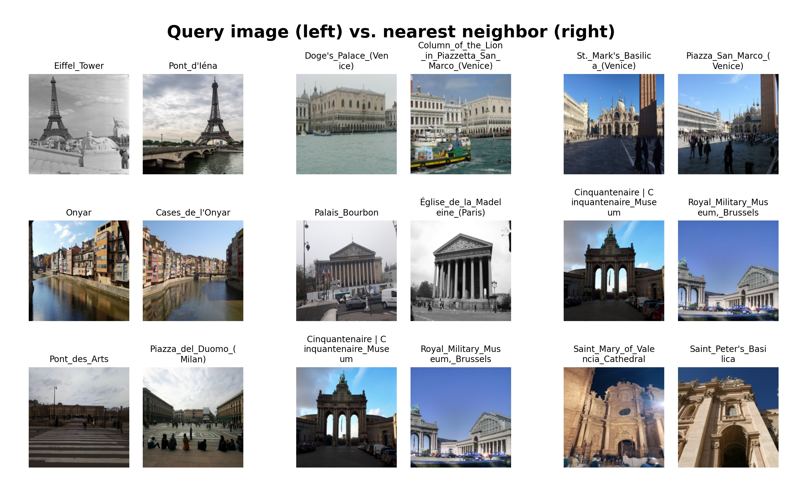
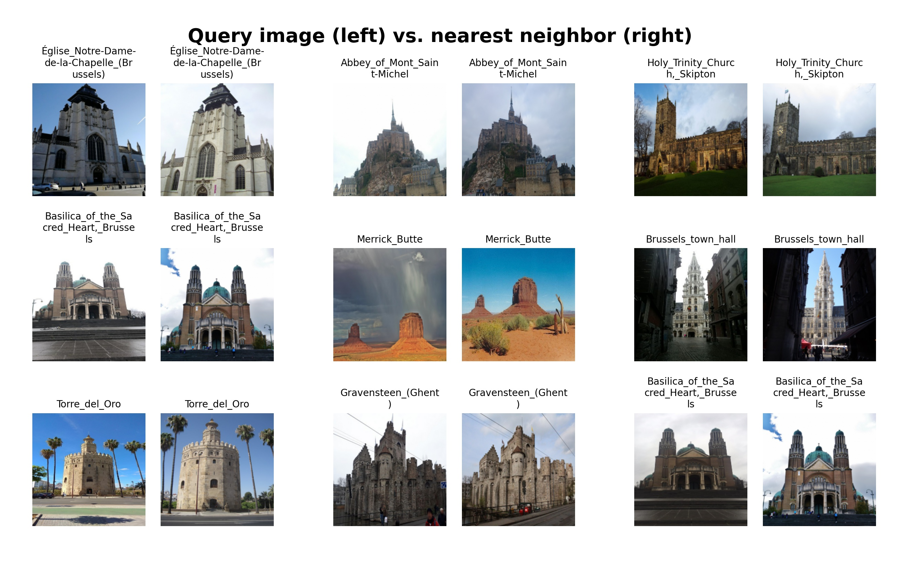

# Google Landmark Recognition Challenge
##### Using deep learning to recognize landmarks worldwide

## Summary
This project is my attempt at the Google Landmark Recognition Challenge, which is detailed in [this](https://github.com/cvdfoundation/google-landmark) repo. The [2020](https://www.kaggle.com/c/landmark-recognition-2020/) and [2019](https://www.kaggle.com/c/landmark-recognition-2019/) challenges can be found in Kaggle. Even though I didn't get to participate in the competition, the repo showcases my progress in my machine learning journey, as it was my first end-to-end deep learning project.

Using the private test dataset from the aforementioned repo, which I believe was the same dataset used for the 2019 Kaggle competition, I achieved a GAP score of **0.573** in the final testing stage; using the public test dataset, I achieved GAP score of **0.562**. The highest GAP score on validation set, which only consists of landmark images, was **0.894**. 

Considering the huge amount of classes, I adpoted a metric learning approach using triplet loss. Specifically, subspaces and online hard mining methods were used to address the class variance issues. During prediction, the model simply takes the label of the nearest neighbor of the query image based on their cosine similarity scores. Due to the presences of non-landmark images in the test set (about 99% actually), a reranking step was necessary. I utilized the distraction images from the public/private test dataset as a representation of non-landmark images and computed query image's cosine similarity to the distraction images, which was subtracted from the similarity score. The architecture of choice was **ResNet101**, and the model trained for 4 epochs. More training time and more experimentation on different input image sizes / hyperparameters would be helpful if more computing resources were available.

## Dataset
The main training dataset used is the cleaned version with 1.58m images and 81313 classes. Data cleaning was performed by filtering out images with less than 3 outdoor votes out of the top 5 categories using the [Places365](https://github.com/CSAILVision/places365) ResNet50 pretrained model and also images with less than 10 samples. Removing only outdoor images is not the perfect solution but it helps in maintaining the feature consistency of a landmark.

The training set has 1085815 samples and 34644 classes. To speed up training, the validation set only represents a subset of 5000 classes with 12724 samples, while the database images consist of the 108279 samples from the full dataset for the same 5000 classes.

## Visualizations
I compared the query images against its nearest neighbors to observe how the model was performing. One discovery is that sometimes a location contains multiple landmarks or has other related landmarks in the background. If the true label does not reflect this, a reasonable prediction would be flagged as incorrect. But in general, the model seems to produce good quality embeddings and can pick up traits that are difficult for humans to detect between highly diverse angles or perspectives.

Top 9 most confident correct predictions:

Top 9 least confident correct predictions:

Top 9 most confident incorrect predictions (some correct predictions but marked wrong due to labelling issues):

Some more incorrect predictions with relatively high confidence (picked up some features but not quite):

Some more correct predictions with high confidence:

## References
Some implementations were inspired by the following work. Huge thanks to the authors for sharing.
- <https://omoindrot.github.io/triplet-loss#offline-and-online-triplet-mining>   
- <https://github.com/NegatioN/OnlineMiningTripletLoss/blob/master/online_triplet_loss/losses.py>   
- <https://openaccess.thecvf.com/content_ICCV_2017_workshops/papers/w27/Wang_How_to_Train_ICCV_2017_paper.pdf>   
- <https://github.com/filipradenovic/cnnimageretrieval-pytorch/tree/6d4ce7854198f132176965761a3dc26fffaf66c5>
- <https://www.kaggle.com/rsmits/keras-landmark-or-non-landmark-identification>
- <https://github.com/psinger/kaggle-landmark-recognition-2020-1st-place/tree/a4a467143b12315a784e91dcb3fc332cdcb5cc27>
- <https://arxiv.org/pdf/1703.07737.pdf>
- <https://github.com/adambielski/siamese-triplet/blob/0c719f9e8f59fa386e8c59d10b2ddde9fac46276/datasets.py>
- <https://github.com/getkeops/keops/blob/master/pykeops/tutorials/kmeans/plot_kmeans_torch.py>